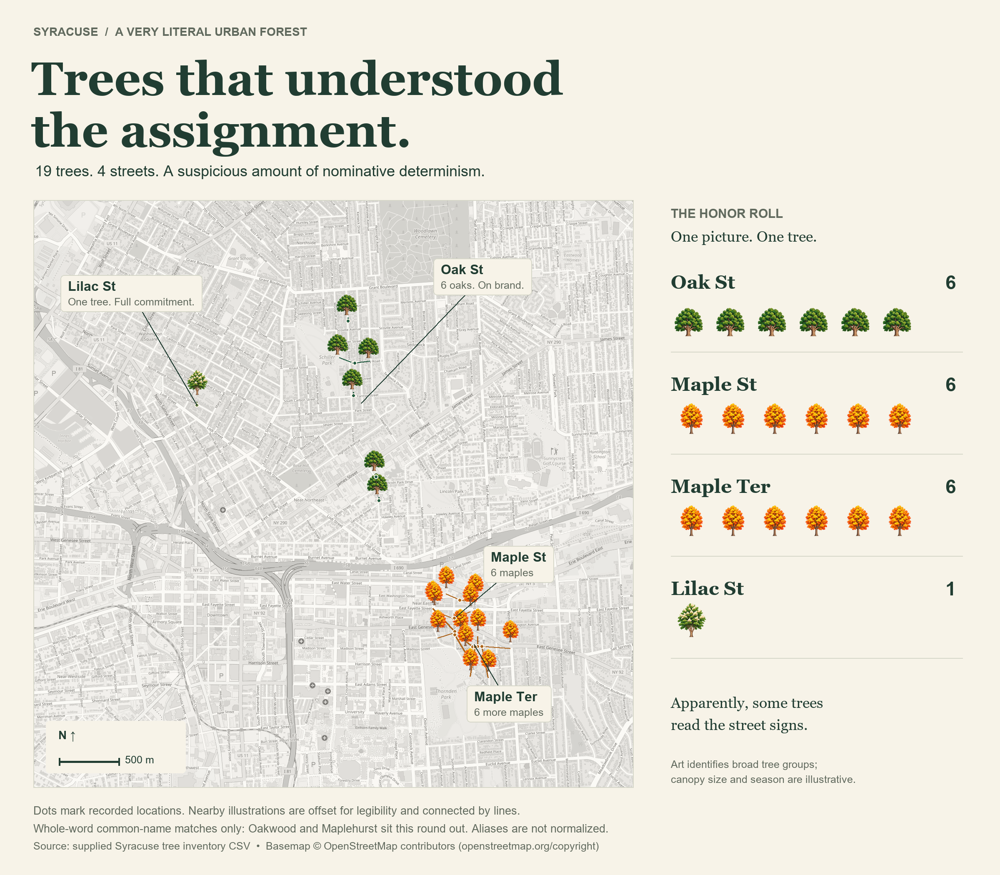
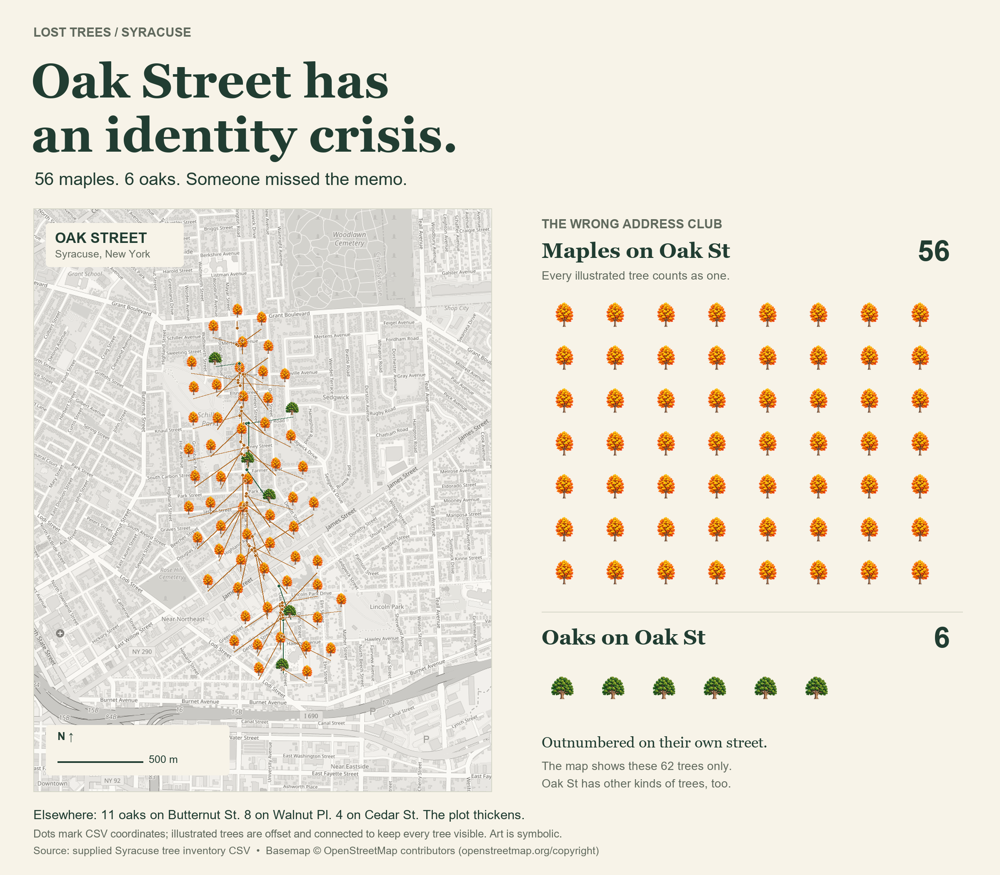

# Are there oak trees on Oak Street?

Some questions demand sophisticated analysis. This one required a spreadsheet and an unreasonable commitment to taking street names literally.

I wanted to know: **are there oak trees on Oak Street in Syracuse?**

According to the city's [tree inventory on data.syr.gov](https://data.syr.gov/datasets/7982e38ea4b545289736a1f42e413632_0/explore), yes. The CSV I checked lists **six**: four red oaks, one swamp white oak, and one black oak.

Excellent. The street has supporting documentation.

Naturally, I expanded the investigation. Using Python to compare tree names with street names, I found 19 whole-word matches: six oaks on Oak Street, six maples on Maple Street, six more on Maple Terrace, and one Japanese tree lilac on Lilac Street.

Some trees understood the assignment.

*One illustrated tree per record. The lone lilac is carrying the entire brand.*

If we loosen the rules to include names like Oakwood and Maplehurst, the count rises to 65. But I wanted to see who followed the instructions exactly.

Then I checked the trees that got lost.

**Oak Street has 56 maples. And six oaks.**

The maples outnumber the oaks by more than nine to one. Oak Street may want to schedule a branding meeting.

*Oak Street has an identity crisis. Other kinds of trees live there, too; this comparison shows just the maples and oaks.*

Meanwhile, 11 oaks are on Butternut Street, eight are on Walnut Place, and four are on Cedar Street. Of the 1,836 oak records in the CSV, 1,830 have addresses somewhere other than Oak Street.

Some trees read the street signs. Others branch out.

---

*Source and method: [City of Syracuse tree inventory, data.syr.gov](https://data.syr.gov/datasets/7982e38ea4b545289736a1f42e413632_0/explore). Counts reflect the downloaded CSV, not a new field survey. I compared the common-name text before the comma in `SPP_COM` with `STREET`, ignoring capitalization; alternate names weren't reconciled. Map dots use recorded coordinates, with illustrations offset for readability. Tree artwork is AI-generated and symbolic. Basemap © [OpenStreetMap contributors](https://www.openstreetmap.org/copyright).*
