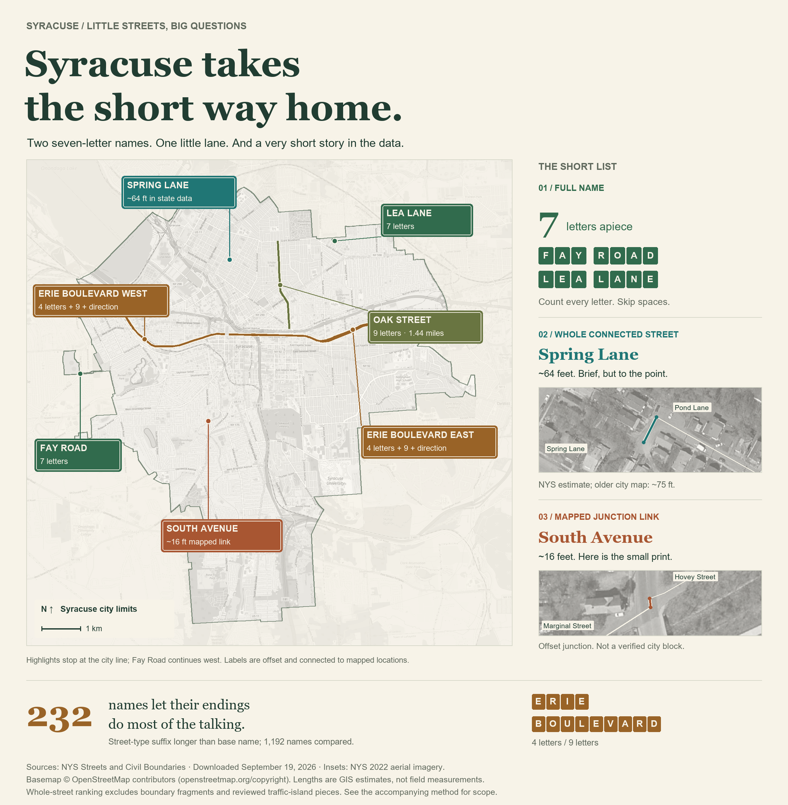

# Syracuse's shortest street? Let's not take a shortcut.

What's Syracuse's shortest street? It sounds like a straightforward question. Naturally, it sent me in three directions.

First, the shortest **name**, counting every letter in the full, spelled-out name. “Street,” “Lane,” and directional words all come along for the ride; spaces and punctuation stay home. **Fay Road and Lea Lane** tie at just **seven letters**. Oak Street, despite its compact three-letter beginning, needs nine. The suffix can take the scenic route.

The suffixes have their own ego problem. Among 1,192 qualifying names, **232 have a street-type ending longer than the base name**. Oak Street devotes twice as many letters to “Street” as “Oak.” Erie Boulevard goes further: nine letters of Boulevard, four of Erie. Talk about giving a name the runaround.

Next: the shortest **block-to-block segment**. Here, we hit a roadblock. The shortest mapped link between street junctions is about **16 feet of South Avenue**, between Hovey and Marginal streets. Aerial imagery shows an offset junction, not a miniature conventional block. The calculation finds the shortest mapped link; it doesn't establish Syracuse's shortest real city block. We shouldn't cut that corner.

Finally, join connected pieces carrying the same name. Excluding boundary fragments and traffic-island scraps, **Spring Lane**, a dead end off Pond Lane on the Northside, leads the state-data ranking at approximately **64 feet**. The older city map draws it at about 75 feet, so this is a map-based estimate, not a tape-measure record.

For perspective, nine-letter Oak Street adds up to about **1.44 miles** when its pieces are connected. That's why we joined the blocks before judging whole streets: one short stretch doesn't tell you how far the name travels. A short name can take you a long way.

Spring Lane, meanwhile, makes its point without going on and on. A brief address, you might say.

---

**Sources and scope:** DataCuse calculations from [NYS Streets](https://services6.arcgis.com/EbVsqZ18sv1kVJ3k/arcgis/rest/services/NYS_Streets/FeatureServer/0), downloaded September 19, 2026, using the [NYS Syracuse city boundary](https://gisservices.its.ny.gov/arcgis/rest/services/NYS_Civil_Boundaries/MapServer/4). Named public surface streets; private roads, ramps, driveways and paths excluded. Whole-street leaders must lie wholly within the city. Comparison: [city Streets layer](https://services6.arcgis.com/bdPqSfflsdgFRVVM/ArcGIS/rest/services/Streets/FeatureServer/0). Aerial review: [NYS 2022 imagery](https://orthos.its.ny.gov/arcgis/rest/services/wms/2022/MapServer). Field measurement and present-day site verification have not been performed. [Full method and review notes](../analysis/methodology.md).

The canonical website article, including publication metadata, is now [index.md](index.md).
