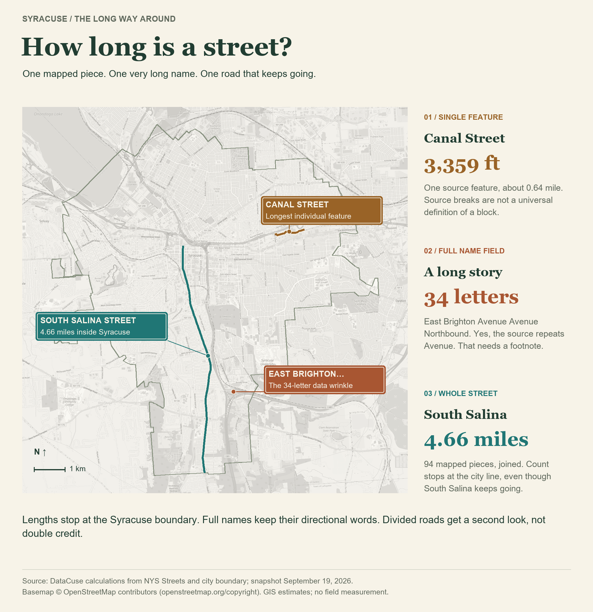

After investigating [Syracuse's shortest street](/stories/syracuse-shortest-street/), I wondered how far the opposite question would take me. The answer: **about 4.66 miles along South Salina Street**, if we're measuring a whole named street inside Syracuse. Getting there required a small detour through the alphabet, and deciding that a road separated by a median shouldn't be counted twice.

First, the longest **individual mapped segment**. **Canal Street** takes this one: approximately **3,359 feet**, or **0.64 mile**, between Peat Street and South Midler Avenue/Simon Drive junctions. It bends through an industrial stretch north of Erie Boulevard.

In the end, this might not be the most conventional city block, but it is the longest segment nonetheless.

Next, the longest **name**. As in the shortest-street story, every letter in the full name counts, including directions and spelled-out street types. Spaces and punctuation get the day off.

The literal winner among 1,192 qualifying names is **East Brighton Avenue Avenue Northbound: 34 letters**. Yes, “Avenue” appears twice in the source. The name has apparently requested an extension.

That makes it the longest **database label**, but maybe not what you'd see on a street sign. “Genant to North Clinton Connector” has 29 letters, but reads like directions. The two West Street Arterial entries, Northbound and Southbound, each have 28. For a more familiar street-style entry, **Onondaga Creek Boulevard East** brings 26 letters; Elizabeth Blackwell Street has 24. As with all things data, there's always messiness. So now you get to see it.

Finally, the **whole street**, joining its street segments. Simply adding every same-name line puts **Erie Boulevard East at 5.93 miles**, ahead of South Salina. But much of Erie is separated by a median, so shows up as separate street segments in the data. Adding both gives the same stretch of boulevard credit twice.

Tracing the corridor once, from Salina Street to the city boundary near Thompson Road, puts Erie at approximately **3.57 miles**. South Salina's **94 pieces** form one unbranched line totaling **4.66 miles**. Every other name's entire mapped sum is below South Salina's, even before checking those roads for double-counting. South Salina goes the extra mile without submitting the return trip.

Where does South Salina really end? At its **northern end**, the state data changes the name to **North Salina at Erie Boulevard**. At its **southern end**, our count stops at the **city line just south of Dorwin Avenue**. South Salina itself continues into the Town of Onondaga. The road hasn't run out; Syracuse has.

So the street gets 4.66 miles. The longest street in Syracuse.

---

*Source and method: DataCuse calculations from [NYS Streets](https://services6.arcgis.com/EbVsqZ18sv1kVJ3k/arcgis/rest/services/NYS_Streets/FeatureServer/0) and [NYS city boundaries](https://gisservices.its.ny.gov/arcgis/rest/services/NYS_Civil_Boundaries/MapServer/4), using the September 19, 2026 download from the shortest-street investigation. Named public surface streets; private-road classes, freeways, ramps, driveways, and paths excluded. Lengths are projected GIS estimates clipped to Syracuse, not field measurements. Full names retain directional words; North/South and East/West names stay separate. Erie comparisons trace mapped same-name paths without traffic-direction restrictions, not driving routes. Name-field anomalies remain in the ranking; no street-sign survey was performed. Aerials: [NYS 2022 imagery](https://orthos.its.ny.gov/arcgis/rest/services/wms/2022/MapServer). Locator basemap © [OpenStreetMap contributors](https://www.openstreetmap.org/copyright).*
