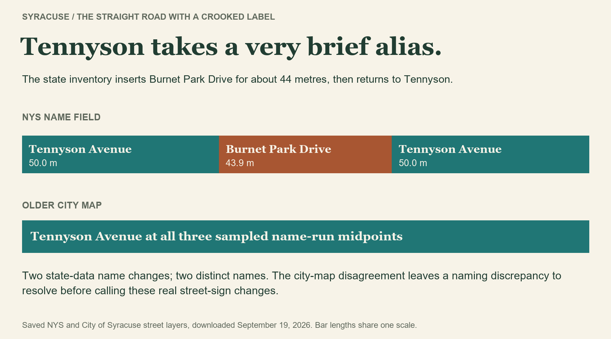

I was interested in which Syracuse street changes names the most while still maintaining a relatively straight path. 

The strongest example is **Monticello Drive South → Monticello Drive North → Springbrook Avenue**. Three different street  names, two changes, and very little meandering. South becomes North at East Seneca Turnpike; Springbrook begins at East Glen Avenue. And yes, I'm counting changing South to North.

The tested stretch covers about **687 metres, or 0.43 mile**. Its endpoints are about 685 metres apart. 

If we require the entire road stretch to stay **within 10 metres of the line connecting its endpoints**, with **no more than 1% extra travel distance**. Start 50 metres before the first name change and finish 50 metres after the last, so a street has to stick around beyond the junction. Test every consecutive name sequence with enough road at both ends, within the continuous chains described below.

Among those **218 tested stretches, two changes is the maximum**. Monticello is tied with a much shorter example: **Tennyson Avenue → Burnet Park Drive → Tennyson Avenue**. The state inventory assigns about 44 metres to Burnet Park Drive before switching back. That's two changes but only results in two distinct names.

Think of laying a ruler on the map: which roads count as straight depends on where you put it and how much wiggle room you allow. I tried starting and stopping 25 or 100 metres beyond the first and last name changes, instead of 50. The most name changes I found was still two, though the stretches that passed could change. But allow only five metres of wiggle room on either side of the ruler, and Monticello no longer passes. Only the Tennyson example remains—and the state and city maps disagree about whether that little stretch is called Burnet Park Drive at all.

Now for the roads that simply keep going. To find continuous chains, I paired each branch with its mutual straightest continuation, allowing up to **30 degrees at mapped joins**. That decision produced two leaders with **four name changes**: Crawford → Broad → Berkeley → Ostrom → Comstock Place, and State Fair Boulevard → Spencer → West Kirkpatrick → West Court → Court.

But Crawford–Comstock travels **2.90 miles between endpoints only 0.98 mile apart**. State Fair–Court travels **2.50 miles versus 1.98 miles directly**. Their sweeping shapes pass the junction rule and fail the ruler test spectacularly.

In Syracuse, even going straight can mean learning a new street name. Monticello manages it twice in less than half a mile.

---

*Source and method: [NYS Streets](https://services6.arcgis.com/EbVsqZ18sv1kVJ3k/arcgis/rest/services/NYS_Streets/FeatureServer/0), [NYS city boundaries](https://gisservices.its.ny.gov/arcgis/rest/services/NYS_Civil_Boundaries/MapServer/4) and the [City of Syracuse Streets layer](https://services6.arcgis.com/bdPqSfflsdgFRVVM/ArcGIS/rest/services/Streets/FeatureServer/0), using saved September 19, 2026 downloads. Named active public surface streets inside Syracuse; private roads, freeways, ramps, driveways and paths excluded. Full names retain directions; repeat names count as further changes. Continuous chains use mutual straightest joins ≤30°, measured over up to 10 m per piece, with compatible elevation and 0.5 m endpoint tolerance. Straightness tests use finite endpoint lines and all geometry vertices within those chains, not an exhaustive search of every possible route or endpoint placement. Reality checks: older city-map names and [NYS 2022 aerial imagery](https://orthos.its.ny.gov/arcgis/rest/services/wms/2022/MapServer), inspected September 20, 2026. Distances are projected GIS estimates; continuity and straightness are chosen rules, not stored facts.*
