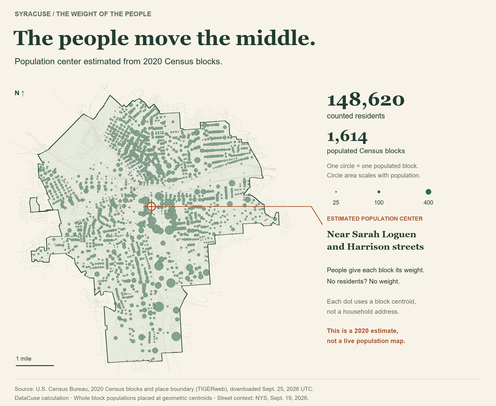
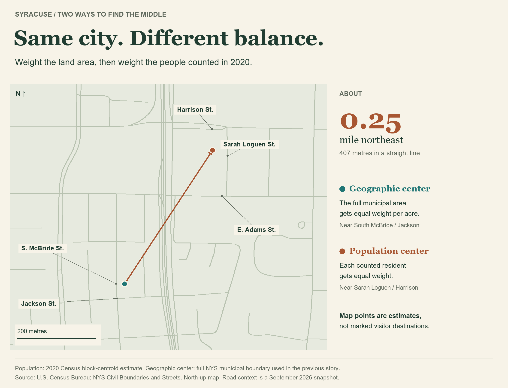

There's a geographic center of Syracuse, but what about the population center?

Imagine a weightless map with one identical little weight for every resident, placed where they live. The **population center** is the spot where that map would balance on your finger.

Using the 2020 Census, Syracuse's estimated balance point lands **near Sarah Loguen and Harrison streets**. That's about a quarter-mile northeast of the [geographic center from the previous story](/stories/syracuse-geographic-center/).

The Census doesn't give us everyone's front-door coordinates. So instead, I put each block's residents at the middle of that block, then found the balance point of all **148,620 people**. A block with 100 people gets ten times the weight of a block with ten. An empty block gets none.

Given population changes over the last few years, this estimate might have changed slightly, but I'm using the data I have!

But whose middle?

Repeat the calculation using only residents in an age group, and the dot moves. The **under-18 center sits about 0.24 mile northwest** of the citywide point. The **65-and-older center sits about 0.26 mile southeast**. The 18–34 group also pulls southeast; ages 35–64 pull northwest.

Race gives us another set of middles. The center for residents counted as **Asian alone** falls about **0.58 mile north** of the citywide point. For **Black or African American alone**, it's about **0.30 mile southwest**; for **White alone**, about **0.13 mile northeast**.

“Alone” is Census terminology for people recorded in one race category. People recorded in two or more races have their own category. These groups include people of any Hispanic or Latino ethnicity.

**Small groups need a lighter touch.** The Native Hawaiian and Other Pacific Islander category has just 67 people across Syracuse; changing the locations of a few people could move its center substantially. Census privacy protections also add uncertainty to small counts.

Hispanic or Latino ethnicity is a separate question from race. Those 15,625 residents have an estimated center about **0.20 mile west** of the citywide point. They also appear within the race categories above, so these aren't additional residents to add to the total.

See every group's population and distance from the citywide center

Distances below are approximate straight-line distances between calculated centers, not walking routes. Each category set separately adds up to 148,620 residents.

**Age**

| Group | People | Center offset |
| --- | ---: | --- |
| Under 18 | 31,683 | 0.24 mile NW |
| 18–34 | 51,602 | 0.16 mile SE |
| 35–64 | 46,023 | 0.13 mile NW |
| 65+ | 19,312 | 0.26 mile SE |

**Race**

| Group | People | Center offset |
| --- | ---: | --- |
| White alone | 71,175 | 0.13 mile NE |
| Black or African American alone | 45,588 | 0.30 mile SW |
| American Indian and Alaska Native alone | 1,408 | 0.32 mile W |
| Asian alone | 10,403 | 0.58 mile N |
| Native Hawaiian and Other Pacific Islander alone | 67 | 0.33 mile S |
| Some Other Race alone | 6,574 | 0.18 mile W |
| Two or More Races | 13,405 | 0.14 mile NW |

**Ethnicity**

| Group | People | Center offset |
| --- | ---: | --- |
| Hispanic or Latino (any race) | 15,625 | 0.20 mile W |
| Not Hispanic or Latino | 132,995 | 0.02 mile E |

A dot can't tell us how spread out a group is. Two groups could share a balance point while living in very different neighborhoods. These maps don't measure segregation, identify a typical resident's home, or explain why people live where they do.

---

*Source and method: [2020 Census TIGERweb blocks and Syracuse boundary](https://tigerweb.geo.census.gov/arcgis/rest/services/Census2020/tigerWMS_Census2020/MapServer) and [2020 Census Demographic and Housing Characteristics files](https://www2.census.gov/programs-surveys/decennial/2020/data/demographic-and-housing-characteristics-file/New_York/), downloaded September 25, 2026 UTC. DHC tables P1, P3, P4 and P12 supply total population, race, ethnicity and age. Each group's counts weight the same projected block centers; every group total checks against the published Syracuse total. Includes people counted in dorms, nursing facilities and other group quarters. These are block-based approximations using privacy-protected counts, not household locations or current population estimates. Street context: NYS Streets, September 2026 snapshot.*
