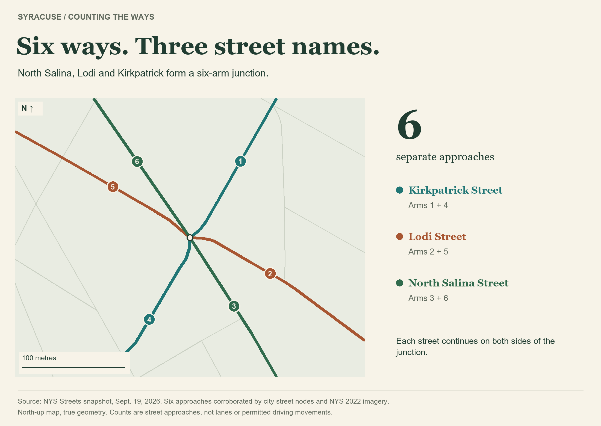
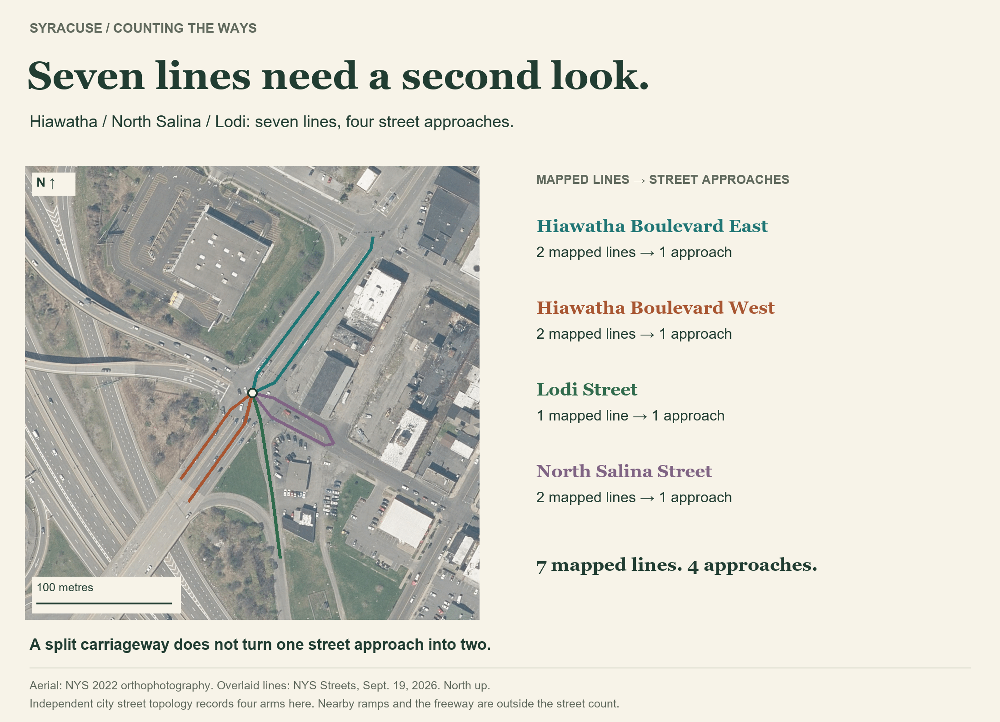
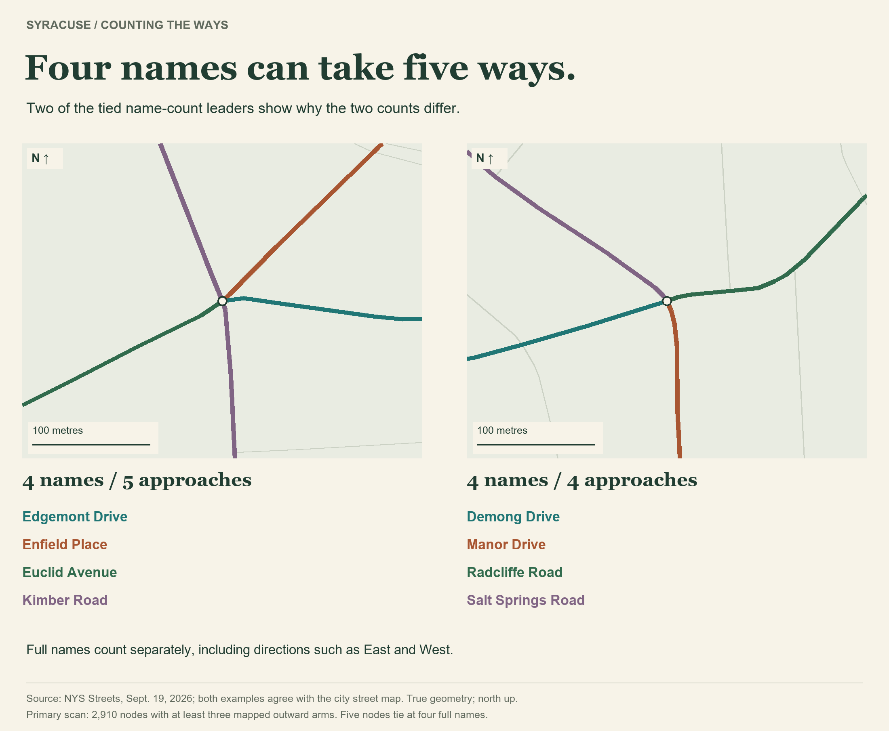

An ordinary crossroads has four arms. Syracuse, naturally, has places that wanted more elbows.

**North Salina Street, Lodi Street and Kirkpatrick Street meet in a six-way junction.** It's the clearest six-approach result in this scan of Syracuse's named public streets, supported by both state and city maps and a check of aerial imagery.

That's **three street names, six approaches**. Each street continues on both sides of the intersection. We're counting the separate roads extending away from the junction, regardless of which way traffic is allowed to travel.

Finding it took more than asking the map which dot had the most lines attached.

The first apparent winner had **seven mapped lines**, where Hiawatha Boulevard meets North Salina and Lodi. But the state map draws separate lines for the two sides of Hiawatha East, Hiawatha West and North Salina. Add one for Lodi, and the computer gets seven.

The aerial shows what those lines represent: **four street approaches**. The city map records four too. A road doesn't become two roads just because there's an island between its lanes.

There is another way to ask the question: **where do the most different street names meet?** That count tops out at **four full names** in the primary state-map scan, with five locations tied. East and West count as part of a full name.

One straightforward example is **Euclid Avenue, Kimber Road, Edgemont Drive and Enfield Place**. Four names meet there, but Kimber continues through, giving the junction five approaches.

Over at **Demong Drive, Manor Drive, Radcliffe Road and Salt Springs Road**, four names produce four approaches. Same name count, different shape. Both examples agree with the city map.

See all five state-map locations tied at four full names

These are the leaders under the same narrow, one-junction rule. They are not five independently verified claims about current street signs.

- **Euclid Avenue / Kimber Road / Edgemont Drive / Enfield Place:** five approaches; names agree with the city map.
- **Demong Drive / Manor Drive / Radcliffe Road / Salt Springs Road:** four approaches; names agree with the city map.
- **Hiawatha Boulevard East / Hiawatha Boulevard West / North Salina Street / Lodi Street:** seven state-map lines, reduced to four street approaches after review; names agree with the city map.
- **South Salina Street / Harrison Street / East Onondaga Street / West Onondaga Street:** five approaches; names agree with the city map.
- **Seymour Street / Shonnard Street / West Adams Street / West Onondaga Street:** five state-map arms. The older city map represents this junction differently, so treat this as a state-data result with a source disagreement.

The boundary of an intersection matters, too. Joining map points within one metre handles tiny gaps. Repeating the scan with no gap allowance, or with five metres, leaves the same two leading candidates. Make the allowance much wider and nearby junctions and divided roads start getting bundled together. That answers a different question.

So, for a clear six-way meeting, **North Salina, Lodi and Kirkpatrick** is the answer this evidence supports. Three streets, each bringing a plus-one.

---

*Source and method: [NYS Streets](https://services6.arcgis.com/EbVsqZ18sv1kVJ3k/arcgis/rest/services/NYS_Streets/FeatureServer/0), [Syracuse city streets](https://services6.arcgis.com/bdPqSfflsdgFRVVM/ArcGIS/rest/services/Streets/FeatureServer/0) and [NYS city boundary](https://gisservices.its.ny.gov/arcgis/rest/services/NYS_Civil_Boundaries/MapServer/4), saved September 19, 2026. The primary graph has 2,910 nodes with at least three outward mapped arms inside Syracuse. Named public surface streets only; private roads, ramps, freeways, driveways and paths excluded. Connections respect the source's elevation levels. Leading junctions checked against the independent city topology and [NYS 2022 aerial imagery](https://orthos.its.ny.gov/arcgis/rest/services/wms/2022/MapServer), retrieved September 25, 2026. Separate carriageways were consolidated at the apparent seven-line leader. These are map-based findings with dated imagery; no field survey was performed.*
